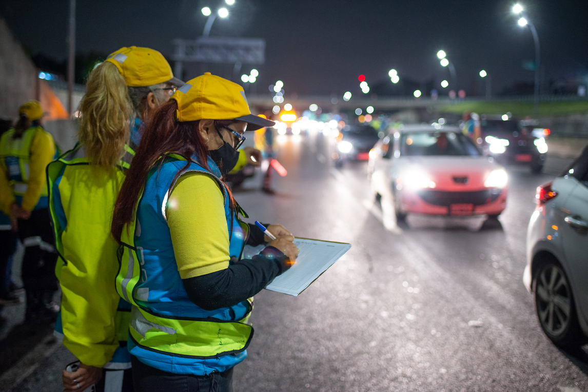

# PI_DA_LB

Como analista de datos, el Observatorio de Movilidad y Seguridad Vial (OMSV), perteneciente al Gobierno de la Ciudad Autónoma de Buenos Aires, me encomienda la elaboración de un proyecto de análisis de datos con el fin de generar información que permita a las autoridades locales tomar medidas para disminuir la cantidad de víctimas fatales en siniestros viales.

## ¿Qué es el OMSV?
El Observatorio de Movilidad y Seguridad Vial de la Ciudad es un centro de estudios de alta eficiencia y nivel técnico cuyo objetivo es producir información para comprender la situación actual de la seguridad vial y la movilidad en la Ciudad. El Gobierno de la Ciudad de Buenos Aires presentó su Segundo Plan de Seguridad Vial con la meta a 10 años de reducir en un 50% las muertes por siniestros fatales para 2030.

## Estado de situación
En Argentina, cada año mueren cerca de 4.000 personas en siniestros viales, siendo esta la principal causa de muertes violentas en el país. Los informes del Sistema Nacional de Información Criminal (SNIC) del Ministerio de Seguridad de la Nación revelan que entre 2018 y 2022 se registraron 19.630 muertes en siniestros viales en todo el país, equivalente a 11 personas por día. En la Ciudad Autónoma de Buenos Aires, durante el 2022 fallecieron 111 personas como consecuencia de un siniestro vial, con una tasa de mortalidad (4,1 decesos cada 100.000 habitantes) por debajo de las registradas a nivel nacional. Durante los años 2019, 2020 y 2021 se observa una disminución progresiva en el número de víctimas fatales en siniestros viales en la Ciudad, sugiriendo la importancia de medidas continuas de seguridad vial y una mayor atención en áreas específicas de la ciudad con altos índices de siniestralidad.

**Fuente**: [Buenos Aires - Plan de Seguridad Vial](https://buenosaires.gob.ar/movilidad/plan-de-seguridad-vial/que-es-el-omsv)

La metodología y fuentes de información aportadas por el organismo pueden consultarse en el siguiente [enlace](https://cdn.buenosaires.gob.ar/datosabiertos/datasets/transporte-y-obras-publicas/victimas-siniestros-viales/NOTAS_HOMICIDIOS_SINIESTRO_VIAL.pdf).

## Material de estudio

El OMSV nos proporciona un dataset sobre homicidios en siniestros viales ocurridos en la Ciudad de Buenos Aires durante el periodo 2016-2021, disponible en formato xlsx con dos hojas llamadas "hechos" y "víctimas". Estos datos incluyen fecha y ubicación del hecho, tipo de transporte involucrado, género y edad de las víctimas, así como el tipo de lesión sufrida. Además, contamos con material de apoyo, como dataset de 'lesiones', también disponibles desde la información pública que brinda el ente, para profundizar en el análisis del fenómeno estudiado.

**Descarga**: [Víctimas en siniestros viales](https://data.buenosaires.gob.ar/dataset/victimas-siniestros-viales)

## Objetivos 

El requerimiento solicita la entrega de un documento explicativo del análisis explotario de los datos otorgados, una presentación -dashboard- que sea interactiva y permita explorar detalladamente los datos de cada sección y, que a su vez, facilite la interpretación de la información y su análisis. En dicha presentación, se solicita graficar y medir 3 KPIs que son detallados a continuación. 

* Reducir en un 10% la tasa de homicidios en siniestros viales de los últimos seis meses, en CABA, en comparación con la tasa de homicidios en siniestros viales del semestre anterior.
* Reducir en un 7% la cantidad de accidentes mortales de motociclistas en el último año, en CABA, respecto al año anterior.
* El tercer KPI queda a cargo mi consideración respecto a una temática que encuentre relevante. 

## Desarrollo del trabajo

En el presente repositorio, encontrarás...
