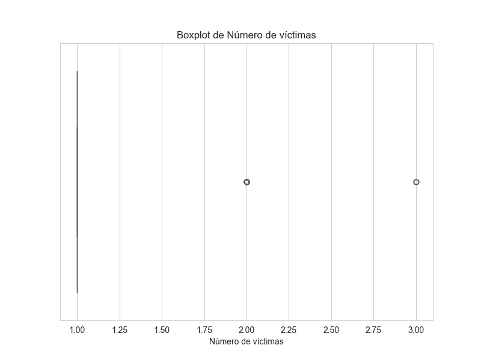
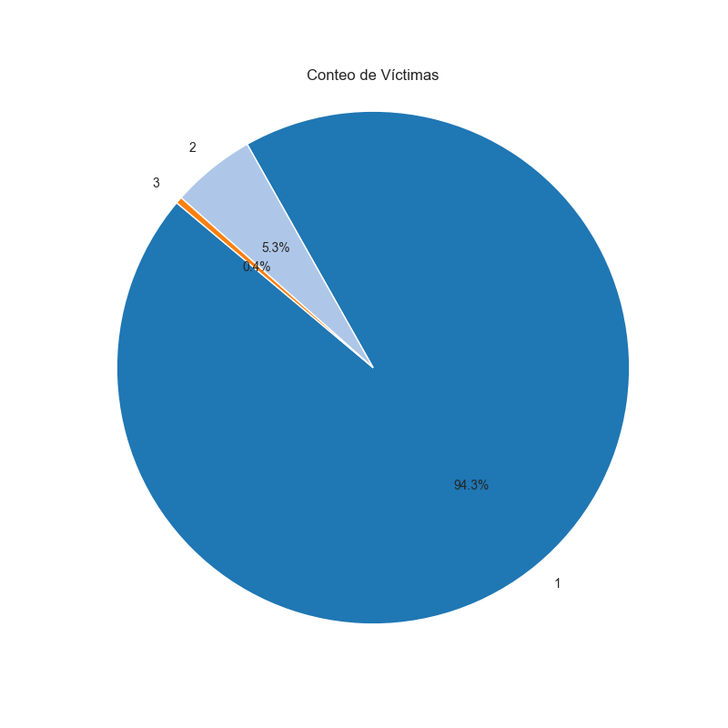

# PI_DA_LB

## Introducción

Como analista de datos, he sido encomendado por el Observatorio de Movilidad y Seguridad Vial (OMSV), perteneciente al Gobierno de la Ciudad Autónoma de Buenos Aires, para desarrollar un proyecto de análisis de datos con el objetivo de proporcionar información crucial para que las autoridades locales tomen medidas que ayuden a reducir la cantidad de víctimas fatales en siniestros viales.

## Sobre el OMSV

El Observatorio de Movilidad y Seguridad Vial de la Ciudad es un centro de estudios altamente eficiente y técnico cuyo propósito es generar información para comprender la situación actual de la seguridad vial y la movilidad en la Ciudad. Como parte de su misión, el Gobierno de la Ciudad de Buenos Aires ha presentado su Segundo Plan de Seguridad Vial con el objetivo a diez años de reducir en un 50% las muertes por siniestros fatales para 2030.

## Estado de Situación

En Argentina, aproximadamente 4.000 personas mueren cada año en siniestros viales, siendo esta la principal causa de muertes violentas en el país. Según los informes del Sistema Nacional de Información Criminal (SNIC) del Ministerio de Seguridad de la Nación, entre 2018 y 2022 se registraron 19.630 muertes en siniestros viales en todo el país, lo que equivale a un promedio de 11 personas por día. En la Ciudad Autónoma de Buenos Aires, en el año 2022 fallecieron 111 personas como resultado de siniestros viales, con una tasa de mortalidad de 4,1 decesos por cada 100.000 habitantes, por debajo de las tasas registradas a nivel nacional. Durante los años 2019, 2020 y 2021, se observó una disminución progresiva en el número de víctimas fatales en siniestros viales en la Ciudad, lo que sugiere la importancia de medidas continuas de seguridad vial y una mayor atención en áreas específicas de la ciudad con altos índices de siniestralidad.

**Fuente**: [Buenos Aires - Plan de Seguridad Vial](https://buenosaires.gob.ar/movilidad/plan-de-seguridad-vial/que-es-el-omsv)

La metodología y fuentes de información proporcionadas por el organismo pueden consultarse en el siguiente [enlace](https://cdn.buenosaires.gob.ar/datosabiertos/datasets/transporte-y-obras-publicas/victimas-siniestros-viales/NOTAS_HOMICIDIOS_SINIESTRO_VIAL.pdf).

## Material de Estudio

El OMSV nos ha proporcionado un conjunto de datos sobre homicidios en siniestros viales ocurridos en la Ciudad de Buenos Aires durante el período 2016-2021. Estos datos están disponibles en formato xlsx con dos hojas llamadas "hechos" y "víctimas", que incluyen información como fecha y ubicación del hecho, tipo de transporte involucrado, género y edad de las víctimas, así como el tipo de lesión sufrida. Además, contamos con material de apoyo, como el dataset de 'lesiones', también disponible a través de la información pública proporcionada por el ente, para profundizar en el análisis del fenómeno estudiado.

**Descarga**: [Víctimas en siniestros viales](https://data.buenosaires.gob.ar/dataset/victimas-siniestros-viales)

## Estructura de los Datos

El trabajo se realizó en base a los siguientes archivos disponibles en el repositorio:

- **1_README.md**: El presente documento, que proporciona una introducción y una visión general del proyecto.
- **2_ETL.ipynb**: Un notebook que contiene el proceso de extracción, transformación y carga de datos.
- **3_EDA.ipynb**: Un notebook que contiene el análisis exploratorio de datos.
- **4_PI_DA_LB.pbix**: Un archivo de Power BI que contiene el tablero interactivo desarrollado para visualizar y analizar los datos.

## Objetivos

El requerimiento solicita la entrega de un documento explicativo del análisis exploratorio de los datos otorgados, una presentación interactiva que permita explorar detalladamente los datos de cada sección y, a su vez, facilite la interpretación de la información y su análisis. En dicha presentación, se solicita graficar y medir 3 KPIs que son detallados a continuación:

1. Reducir en un 10% la tasa de homicidios en siniestros viales de los últimos seis meses, en CABA, en comparación con la tasa de homicidios en siniestros viales del semestre anterior.
2. Reducir en un 7% la cantidad de accidentes mortales de motociclistas en el último año, en CABA, respecto al año anterior.
3. El tercer KPI queda a mi consideración respecto a una temática que encuentre relevante.

## Desarrollo del Trabajo

### Extracción, Transformación y Carga (ETL)

En el proceso de Extracción, Transformación y Carga (ETL), se llevaron a cabo las siguientes acciones:

- Se eliminaron columnas redundantes o que no serían tenidas en cuenta en la exploración de datos.
- Se aseguró que el tipo de dato de cada categoría o columna fuera adecuado.
- Se reemplazaron los valores nulos por NaN para facilitar el análisis.
- Se agregó una columna para identificar el día de la semana en función de la fecha.
- Se agregó la columna `COMUNA_NOMBRE`, donde se incluyó la información sobre las comunas de la Ciudad de Buenos Aires desde la siguiente fuente: 
[Gobierno de la Ciudad de Buenos Aires - Comunas](https://www.argentina.gob.ar/caba/comunas).
- Se agregó la información sobre la población de las comunas, tomando los datos del siguiente enlace:
[Wikipedia - Comunas de la ciudad de Buenos Aires por población](https://es.wikipedia.org/wiki/Anexo:Comunas_de_la_ciudad_de_Buenos_Aires_por_poblaci%C3%B3n). 

Cabe destacar que, aunque el estudio abarca el período de 2016 a 2021, se optó por utilizar un único valor de población proveniente del CENSO 2022 en lugar de estimaciones de población para cada año.

Estas acciones fueron llevadas a cabo para preparar los datos de manera adecuada antes de realizar el análisis exploratorio.

### Análisis Exploratorio de Datos (EDA)

Luego de completar el proceso de Extracción, Transformación y Carga (ETL), se procedió con el análisis exploratorio de datos utilizando el dataset limpio. A continuación, se detallan los pasos, observaciones y decisiones tomadas durante este proceso:

1. **Descripción del Dataset**: Se cargaron los datos y se realizó una descripción general del dataset.

2. **Verificación de Registros Duplicados y Nulos**: Se verificaron registros duplicados y nulos. Se analizó en qué casos se pueden completar nulos sin que esto altere el resultado de los informes a mostrar más adelante. 

    Como prioridad, se estableció no eliminar ningún registro debido a la falta de datos. El indicador más relevante solicitado es la cantidad de víctimas en un período determinado, la cual no se encontraba afectada por los valores faltantes.

3. **Búsqueda de Valores Atípicos con Boxplot**: Se realizó la búsqueda de valores atípicos utilizando boxplot.

     Se realizó un análisis exhaustivo sobre las variables numéricas, el cual reveló que **no se detectaron valores atípicos** en la distribución de las columnas estudiadas. Los valores máximos para cada una de estas variables se consideran razonables según su definición. 
     
     Específicamente, al examinar el número de víctimas por evento (N_VICTIMAS), se observó una concentración significativa en el valor '1', aunque se identificaron algunos valores fuera del rango de '2' y '3' en el boxplot correspondiente. 
     
    

        
    

    

        
    

          
     Sin embargo, dado el contexto y la naturaleza de los accidentes, se concluyó que estos resultados son consistentes y comprensibles, reflejando la realidad del número de víctimas en incidentes viales.

