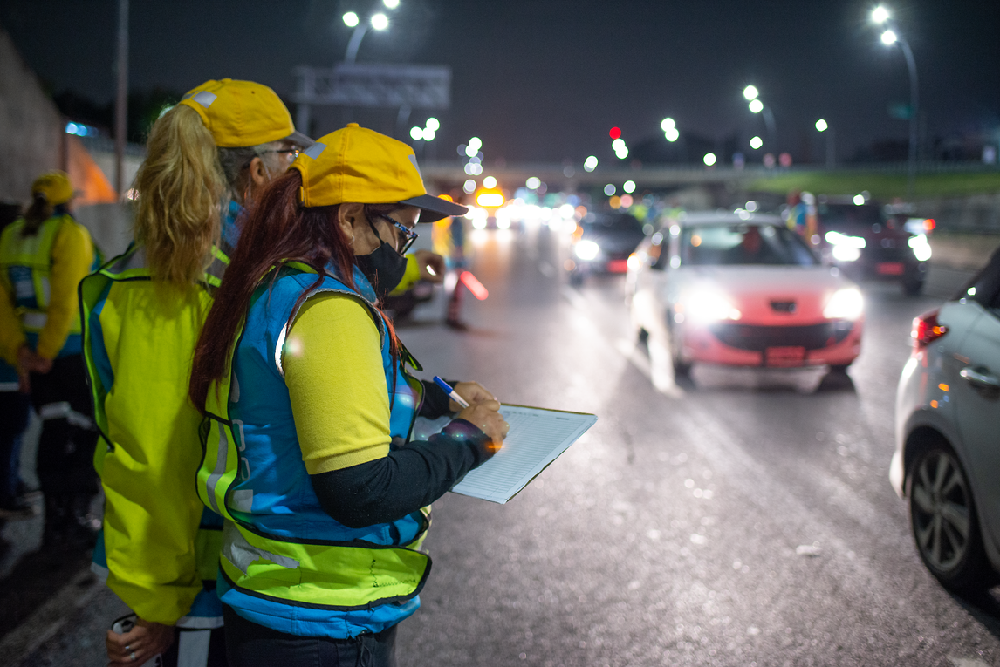
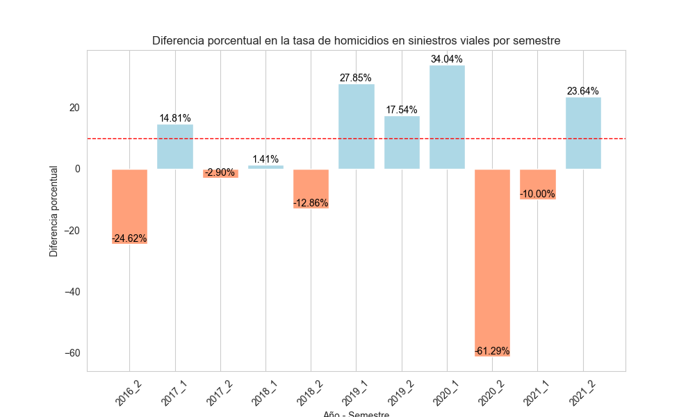

# PI_DA_LB

## Introducción

Como analista de datos, he sido encomendado por el Observatorio de Movilidad y Seguridad Vial (OMSV), perteneciente al Gobierno de la Ciudad Autónoma de Buenos Aires, para desarrollar un proyecto de análisis de datos con el objetivo de proporcionar información crucial para que las autoridades locales tomen medidas que ayuden a reducir la cantidad de víctimas fatales en siniestros viales.

## Sobre el OMSV

El Observatorio de Movilidad y Seguridad Vial de la Ciudad es un centro de estudios altamente eficiente y técnico cuyo propósito es generar información para comprender la situación actual de la seguridad vial y la movilidad en la Ciudad. Como parte de su misión, el Gobierno de la Ciudad de Buenos Aires ha presentado su Segundo Plan de Seguridad Vial con el objetivo a diez años de reducir en un 50% las muertes por siniestros fatales para 2030.

## Estado de Situación

En Argentina, aproximadamente 4.000 personas mueren cada año en siniestros viales, siendo esta la principal causa de muertes violentas en el país. Según los informes del Sistema Nacional de Información Criminal (SNIC) del Ministerio de Seguridad de la Nación, entre 2018 y 2022 se registraron 19.630 muertes en siniestros viales en todo el país, lo que equivale a un promedio de 11 personas por día. En la Ciudad Autónoma de Buenos Aires, en el año 2022 fallecieron 111 personas como resultado de siniestros viales, con una tasa de mortalidad de 4,1 decesos por cada 100.000 habitantes, por debajo de las tasas registradas a nivel nacional. Durante los años 2019, 2020 y 2021, se observó una disminución progresiva en el número de víctimas fatales en siniestros viales en la Ciudad, lo que sugiere la importancia de medidas continuas de seguridad vial y una mayor atención en áreas específicas de la ciudad con altos índices de siniestralidad.

**Fuente**: [Buenos Aires - Plan de Seguridad Vial](https://buenosaires.gob.ar/movilidad/plan-de-seguridad-vial/que-es-el-omsv)

La metodología y fuentes de información proporcionadas por el organismo pueden consultarse en el siguiente [enlace](https://cdn.buenosaires.gob.ar/datosabiertos/datasets/transporte-y-obras-publicas/victimas-siniestros-viales/NOTAS_HOMICIDIOS_SINIESTRO_VIAL.pdf).

## Material de Estudio

El OMSV nos ha proporcionado un conjunto de datos sobre homicidios en siniestros viales ocurridos en la Ciudad de Buenos Aires durante el período 2016-2021. Estos datos están disponibles en formato xlsx con dos hojas llamadas "hechos" y "víctimas", que incluyen información como fecha y ubicación del hecho, tipo de transporte involucrado, género y edad de las víctimas, así como el tipo de lesión sufrida. Además, contamos con material de apoyo, como el dataset de 'lesiones', también disponible a través de la información pública proporcionada por el ente, para profundizar en el análisis del fenómeno estudiado.

**Descarga**: [Víctimas en siniestros viales](https://data.buenosaires.gob.ar/dataset/victimas-siniestros-viales)

## Estructura de los Datos

El trabajo se realizó en base a los siguientes archivos disponibles en el repositorio:

- **README.md**: El presente documento, que proporciona una introducción y una visión general del proyecto.
- **1_ETL.ipynb**: Un notebook que contiene el proceso de extracción, transformación y carga de datos.
- **2_EDA.ipynb**: Un notebook que contiene el análisis exploratorio de datos.
- **3_PI_DA_LB.pbix**: Un archivo de Power BI que contiene el tablero interactivo desarrollado para visualizar y analizar los datos.

## Objetivos

El requerimiento solicita la entrega de un documento explicativo del análisis exploratorio de los datos otorgados, una presentación interactiva que permita explorar detalladamente los datos de cada sección y, a su vez, facilite la interpretación de la información y su análisis. En dicha presentación, se solicita graficar y medir 3 KPIs que son detallados a continuación:

1. Reducir en un 10% la tasa de homicidios en siniestros viales de los últimos seis meses, en CABA, en comparación con la tasa de homicidios en siniestros viales del semestre anterior.
2. Reducir en un 7% la cantidad de accidentes mortales de motociclistas en el último año, en CABA, respecto al año anterior.
3. El tercer KPI queda a mi consideración respecto a una temática que encuentre relevante.

## Desarrollo del Trabajo

Para los procesos de análisis de datos, se utilizó el software Python con las bibliotecas pandas, matplotlib y seaborn. Esta elección se fundamenta en la versatilidad y eficacia de pandas para la manipulación y transformación de datos, así como en la capacidad de matplotlib y seaborn para visualizar los datos de manera clara y efectiva. Con estas herramientas, fue posible realizar tareas de ETL (Extract, Transform, Load) y EDA (Exploratory Data Analysis) de manera eficiente y flexible. Los gráficos generados con matplotlib y seaborn no solo facilitaron el análisis exploratorio, sino que también sirvieron como base para el diseño de un dashboard intuitivo y visualmente atractivo, lo que permitió comunicar los hallazgos de manera efectiva a los usuarios finales.

### Extracción, Transformación y Carga (ETL)

En el proceso de Extracción, Transformación y Carga (ETL), se llevaron a cabo las siguientes acciones:

- Se eliminaron columnas redundantes o que no serían tenidas en cuenta en la exploración de datos.
- Se aseguró que el tipo de dato de cada categoría o columna fuera adecuado.
- Se reemplazaron los valores nulos por NaN para facilitar el análisis.
- Se agregó una columna para identificar el día de la semana en función de la fecha.
- Se agregó la columna `COMUNA_NOMBRE`, donde se incluyó la información sobre las comunas de la Ciudad de Buenos Aires desde la siguiente fuente: 
[Gobierno de la Ciudad de Buenos Aires - Comunas](https://www.argentina.gob.ar/caba/comunas).
- Se agregó la información sobre la población de las comunas, tomando los datos del siguiente enlace:
[Wikipedia - Comunas de la ciudad de Buenos Aires por población](https://es.wikipedia.org/wiki/Anexo:Comunas_de_la_ciudad_de_Buenos_Aires_por_poblaci%C3%B3n). 

Cabe destacar que, aunque el estudio abarca el período de 2016 a 2021, se optó por utilizar un único valor de población proveniente del CENSO 2022 en lugar de estimaciones de población para cada año.

Estas acciones fueron llevadas a cabo para preparar los datos de manera adecuada antes de realizar el análisis exploratorio.

### Análisis Exploratorio de Datos (EDA)

Luego de completar el proceso de Extracción, Transformación y Carga (ETL), se procedió con el análisis exploratorio de datos utilizando el dataset limpio. A continuación, se detallan los pasos, observaciones y decisiones tomadas durante este proceso:

1. **Descripción del Dataset**: Se cargaron los datos y se realizó una descripción general del dataset.

2. **Verificación de Registros Duplicados y Nulos**: Se verificaron registros duplicados y nulos. Se analizó en qué casos se pueden completar nulos sin que esto altere el resultado de los informes a mostrar más adelante. 

    Como prioridad, se estableció no eliminar ningún registro debido a la falta de datos. El indicador más relevante solicitado es la cantidad de víctimas en un período determinado, la cual no se encontraba afectada por los valores faltantes.

3. **Búsqueda de Valores Atípicos con Boxplot**: Se realizó la búsqueda de valores atípicos utilizando boxplot.

     Se realizó un análisis exhaustivo sobre las variables numéricas, el cual reveló que **no se detectaron valores atípicos** en la distribución de las columnas estudiadas. Los valores máximos para cada una de estas variables se consideran razonables según su definición. 
     
     Específicamente, al examinar el número de víctimas por evento (N_VICTIMAS), se observó una concentración significativa en el valor '1', aunque se identificaron algunos valores fuera del rango de '2' y '3' en el boxplot correspondiente. 
     
     

     
    
          
     Sin embargo, dado el contexto y la naturaleza de los accidentes, se concluyó que estos resultados son consistentes y comprensibles, reflejando la realidad del número de víctimas en incidentes viales.

4. **Análisis de Correlación y Estudio Temporal**

    Se realizó un análisis de víctimas en función de variables temporales, buscando determinar la frecuencia del número de víctimas agrupadas según diferentes variables temporales, con el objetivo de localizar estacionalidad en alguna de ellas. 
    
    * Se llevó a cabo un estudio de correlación utilizando la herramienta subset.coor(). Los resultados muestran valores bajos de correlación entre las variables estudiadas, debido a que predominan variables del tipo categoricas y temporales. 

    

    * Se verificó la variación porcentual de los campos MES, DÍA y HORA en relación a su media. Dado los resultados, se agruparon los horarios según su secuencia y resultado para establecer cuatro grupos de franjas horarias: Mañana (05:00 - 10:00), Mediodía (11:00 - 16:00), Tarde (17:00 - 22:00) y Noche (23:00 - 04:00). Se aprecia que la mayor cantidad de accidentes se da en el período de 'Mañana' para todos los años estudiados.

    

    * Se analizó un mapa de calor entre las variables hora por día y días de la semana, con resultados de distribución uniforme. 
    * Se realizan segmentaciones por semestre. Los segundos semestres hasta el año 2018 se concentraban aumentos de eventos, y que para el año 2019 y 2021, ambos segundos semestre registran dimuniciones en relación a su antecesor. 

    

    
    
    Se observa una notable disminución en el número de víctimas para el año 2019 en comparación con los años anteriores, posiblemente debido a las políticas adoptadas por la Ciudad, como el 'Plan de Seguridad Vial de la Ciudad 2016-2019'. En el año 2020, también se observa una disminución respecto al año anterior, posiblemente influenciada por el inicio de la pandemia. Para el año 2021, se registra un aumento en el número de eventos, aunque la cifra final sigue estando por debajo de la obtenida en el año 2019.

    Fuente: [Plan de Seguridad Vial de la Ciudad](https://buenosaires.gob.ar/movilidad/plan-de-seguridad-vial/plan-de-seguridad-vial-de-la-ciudad)

    
5.  **Estudio de la Ubicación de los Accidentes**

    Se realizó un estudio de la cantidad de eventos en relación a la ubicación del accidente y las características de su locación. Se realizaron gráficos de barras para analizar este aspecto. 

    La comuna con mayor cantidad de víctimas es la correspondiente a **[Retiro, San Nicolás, Puerto Madero, San Telmo, Monserrat, Constitución]**. 
    
    Sin embargo, al calcular la tasa de víctimas de acuerdo a la población indicada por cada comuna, se obtiene que la mayor tasa se da en la comuna de **[Liniers, Mataderos, Parque Avellaneda]**.

    El mayor número de eventos se agrupan en calles tipo AVENIDA y GRAL. PAZ (Que también es una avenida), representando entre ambas el 71,2 % del total. 

    

    En el análisis de las calles en particular con mayor cantidad de accidentes, GRAL. PAZ es la de mayor frecuencia con más del 30% de los casos, seguida por Av. Rivadavia y Av. Del Libertador. 

    

6.  **Estudio de las Víctimas en Relación a sus Características**

    Se llevó a cabo un análisis detallado de las víctimas en relación a diversas características, incluyendo el tipo de víctima, el tipo de acusado, la distribución por género y edades.

    Se verificó la relación entre diversas variables, como el tipo de víctima y el tipo de acusado, así como la distribución de edades en función del género. Estos análisis proporcionaron información relevante sobre las circunstancias y características de los accidentes viales, lo que puede ser útil para futuras medidas de seguridad y prevención.

    #### Tipo de Víctima y Tipo de Acusado

    Se verificó la distribución por tipo de víctima y tipo de acusado. Se observó que, aunque las motocicletas representan el tipo de accidentado con mayor cantidad de fallecimientos, con el **43.8%** del total de casos, estos sólo están identificados como responsables de los accidentes en un **8.4%**. 
    
    Por otro lado, el segundo mayor grupo en cantidad de víctimas son los peatones. Para este grupo, el mayor número de responsabilidad está asignado a los pasajeros, lo que sugiere una correlación entre la presencia de pasajeros en unidades de transporte público y la responsabilidad en accidentes peatonales.

    #### Distribución por Género y Edades

    Se analizó la distribución por género y edades de las víctimas. Se observó una concentración **entre 20 y 40 años** en la distribución de edades, lo que descarta algún indicio de causalidad respecto a la disminución de facultades por longevidad. 
    
    Además, se identificó una disminución importante en la concentración de eventos por edad para el sexo femenino. El género femenino representa el **23.3 %** de las víctimas totales.

    

7.  **Análisis de accidentes mortales de motociclistas**

    Se llevó a cabo un análisis específico sobre las motocicletas, incluyendo diversos aspectos como su distribución por año, mes y semestre, el cálculo de tasas de cambio, la distribución por género y edades, por el tipo de calle y por las calles específicas, así como un estudio sobre los acusados en función de los años.

    #### Distribución por Año, Mes y Semestre

    Se verificó la distribución de accidentes involucrando motocicletas por año, mes y semestre. Se calcularon tasas de cambio para identificar tendencias a lo largo del tiempo y estacionalidades en la incidencia de accidentes.

    #### Distribución por Género y Edades

    Se analizó la distribución de víctimas involucradas en accidentes de motocicletas en función del género y las edades. Este análisis proporcionó información sobre posibles diferencias en la exposición al riesgo y la vulnerabilidad de diferentes grupos demográficos.

    Los resultados arrojaron que la distribución de víctimas motociclistas en relación a las variables temporales, por género y edad, sigue la misma tendencia que para el acumulado de víctimas.

    

    #### Distribución por Tipo de Calle y Calles Específicas

    Se estudió la distribución de accidentes de motocicletas por el tipo de calle y por calles específicas. Este análisis permitió identificar áreas de mayor incidencia de accidentes y posibles factores contribuyentes, como la infraestructura vial y el diseño de las calles.

    Los resultados en el análisis por tipo de calle, se obtuvo un posicionamiento más elevado de accidentes en **CALLES**, siendo este caso mayor al de la Avenida Gral. Paz.

    #### Estudio sobre Acusados en Función de los Años

    Se realizó un análisis sobre los acusados en accidentes de motocicletas en función de los años. Este análisis proporcionó información sobre posibles cambios en la responsabilidad por accidentes a lo largo del tiempo y la efectividad de las medidas de prevención implementadas.

    Se destaca que, aunque las motocicletas son el tipo de víctimas que más registros acumulan, al analizar los tipos de acusado sobre estos casos, su valor disminuye considerablemente en la proporción del total.

    Se puede apreciar que autos y vehículos de carga representan la mayor cantidad de acusados en el transcurso de los años.
    
    Un valor destacado es el caso de objetos fijos, que para el año 2021 es el tipo que más acumula. Este tipo de accidente se define como la colisión contra objetos inmóviles fijados de manera permanente o semipermanente (columna, árbol, semáforo, etc.) o pérdidas de equilibrio de vehículos de dos ruedas que desencadenen la caída de sus ocupantes.

    

8.  **Análisis de accidentes mortales en peatones-pasajeros**

    Se lleva a cabo el estudio del subgrupo de tipo de VICTIMA=PEATON para cuando el ACUSADO es PASAJERO, dado que es llamativo la cantidad de victimas para este grupo específico. 
    
    #### Distribución por Tipo de Calle y Calles Específicas

    Se verificó que el tipo de calle las AVENIDAS agrupan 82 % de los casos, siendo la Av GRAL PAZ solamente el 1.9% a diferencia de la tendencia general para el total de victimas. Al realizar el estudio el cálculo inversamente, se ve que la distribución para las AVENIDAS , son los PEATONES los de mayor incedencia. 

    

    #### Estudio sobre Acusados en Función de los Años y el género

    Se estudio la tendencia para este subgrupo en relación a las edades y el género. 
    
    A diferencia del conjunto total de vicitimas, se aprecia una concentración entre los años 50 y 80. Se destaca, que en el género FEMENINO, la acumlación es preponderante para las mayores de 60 años.

    
        
    
## Desarrollo de indicadores clave de rendimiento

### 1. KPI Siniestros viales

Reducir en un 10% la tasa de homicidios en siniestros viales de los últimos seis meses, en CABA, en comparación con la tasa de homicidios en siniestros viales del semestre anterior.

Definimos a la tasa de homicidios en siniestros viales como el número de víctimas fatales en accidentes de tránsito por cada 100,000 habitantes en un área geográfica durante un período de tiempo específico. Su fórmula es: (Número de homicidios en siniestros viales / Población total) * 100,000

Al comparar de manera intersemestral, se observa que la suma del segundo semestre 2020_2 y el primer semestre 2021 acumulan un aumento del 77% (61.29% + 10%) en relación al periodo de 2020.

Además, el número de víctimas en el primer semestre de 2020 supera al del segundo semestre de 2019, mientras que la reducción en el último semestre de 2021 muestra una disminución significativa no solo respecto al semestre anterior, sino también en comparación con todos los registros, siendo solo superada por el valor del primer semestre de 2020, que se supone fue el más restrictivo y coincidente con el inicio de la pandemia.

Como se observa, a partir del 2019 en adelante existe una tendencia hacia el cumplimiento de la meta, sólo obstaculizada por los periodos de pandemia que no dejan establecer conclusiones claras repecto a la efectividad de acciones que se estuvieran tomando antes y después de la misma. Resaltando que en el año 2021 se vuelve a la senda del cumplimiento de la meta. 
    
### 2. KPI Siniestros motocicletas

Reducir en un 7% la cantidad de accidentes mortales de motociclistas en el último año, en CABA, respecto al año anterior.

Definimos a la cantidad de accidentes mortales de motociclistas en siniestros viales como el número absoluto de accidentes fatales en los que estuvieron involucradas víctimas que viajaban en moto en un determinado periodo temporal. Su fórmula para medir la evolución de los accidentes mortales con víctimas en moto es: (Número de accidentes mortales con víctimas en moto en el año anterior - Número de accidentes mortales con víctimas en moto en el año actual) / (Número de accidentes mortales con víctimas en moto en el año anterior) * 100

    

Al analizar el gráfico resultante, se observa que si bien el indicador es de aceptación en tres de los cinco años estudiados, se destaca que en el año 2021 la tasa de cambio da un valor muy por debajo del porcentaje esperado. 

Se presupone que esto se debe a los eventos muy bajos durante el año 2020 con pandemia, ya que al analizar los valores anuales, el año 2021 sigue en reducción de cantidad de victimas sobre el valor alcanzado en 2019, como vemos en el siguiente gráfico. 

Se realiza un análisis excluyendo los resultados del año 2020 para observar la tendencia, dando resultados más optimistas. Sólo en el año 2018 no se cumple con la meta, aunque la reducción de victimas en el transcurrir del tiempo parece seguir en baja.

### 3. KPI Siniestros peatón-pasajero

Dadas las observaciones en relación al tipo de victima y acusado, es que se decide aportar para el estudio del informe este indicador clave. 

Se define a este subgrupo como "Personas lesionadas que se encuentran dentro, descendiendo o ascendiendo de las unidades de autotrasporte público de pasajeros/as y ómnibus de larga distancia".

---

Reducir en un 10% la cantidad de siniestros de **peatones** con responsabilidad presunta de **pasajeros**, en el último semestre, en CABA, respecto al semestre anterior.

Definimos a la cantidad de accidentes mortales de Peatones-Pasajeros en siniestros viales como el número absoluto de accidentes fatales en los que estuvieron involucradas víctimas del tipo **peatón** para aquellos casos donde se presume en la acusación una responsabilidad por parte del **pasajero** en un determinado periodo temporal. Su fórmula para medir la evolución de los accidentes mortales es: (Número de accidentes mortales de víctimas Peatones-Pasajeros en el semestre anterior - Número de accidentes mortales de víctimas Peatones-Pasajeros en el semestre actual) / (Número de accidentes mortales de víctimas Peatones-Pasajeros en el semestre anterior) * 100

Aunque el KPI se evalúa semestralmente, siendo aceptado en 6 de los 11 períodos, es importante señalar que los semestres en los que no se alcanza el objetivo representan las variaciones porcentuales más significativas respecto al semestre anterior. Esto se debe principalmente a que en esos semestres anteriores se observaron importantes reducciones en el número de víctimas.

Según el análisis anual, se evidencia una disminución de casos a partir de 2018. Resulta notable que el número de víctimas se haya mantenido prácticamente constante entre los años 2019 y 2021, a pesar de la pandemia que ocurrió en 2020, período en el que en otros estudios se registró una reducción general de víctimas.

Al examinar cuantitativamente los semestres, se observa que el segundo período de 2021 finaliza con un valor que se encuentra entre los 3 más bajos registrados, incluyendo el primer período de 2020 que fue afectado por la pandemia.

# Elaboración Dashboard 

Para la presentación fue elegido el software **PowerBI**, que ofrece una interfaz intuitiva y fácil de usar que permite a los usuarios, incluso sin experiencia en programación, realizar análisis de datos complejos y crear visualizaciones impactantes. Proporciona una solución completa y poderosa para el análisis de datos y la creación de informes

A continuación se detallen los procesos más relevantes para la creación del informe:

* Importación de datos: Se importaron los datos relevantes en Power BI desde las fuentes necesarias.

* Transformación de datos: Se llevaron a cabo varias transformaciones de datos utilizando Power Query Editor para limpiar, dar formato y preparar los datos para su análisis.

* Modelado de datos: Se creó un modelo de datos en Power BI que reflejaba la estructura de los datos y las relaciones entre las diferentes tablas.

* Cálculo de medidas: Se crearon medidas utilizando el lenguaje de expresión de datos (DAX) para calcular métricas y KPIs específicos según los requisitos del usuario.

* Creación de visualizaciones: Se diseñaron diferentes visualizaciones, como gráficos de barras, gráficos circulares, tablas y otros elementos visuales, para representar los datos de manera efectiva y comprensible.

* Interacción y filtros: Se configuraron interacciones entre las visualizaciones y se aplicaron filtros para permitir a los usuarios explorar y analizar los datos de manera dinámica.

* Diseño del tablero: Se diseñó y personalizó un tablero en Power BI que presentaba las visualizaciones de manera organizada y atractiva, con el objetivo de comunicar la información de manera clara y efectiva.

El informe se encuentra disponible dentro del **Github** actual, y además, se disponibilizó para su consulta online en el siguiente enlace: 

[Power BI: PI_DA_LB](https://app.powerbi.com/singleSignOn?ctid=1a751f20-baa9-46f3-8ff3-0b96608bb801&pbi_source=linkShare&ru=https%3A%2F%2Fapp.powerbi.com%2Fgroups%2Fme%2Freports%2F0adffc1e-d081-4d18-9d84-098761cbb162%3Fctid%3D1a751f20-baa9-46f3-8ff3-0b96608bb801%26pbi_source%3DlinkShare%26noSignUpCheck%3D1)

# Conclusiones

Durante el desarrollo de este estudio de análisis de datos sobre siniestros viales en la Ciudad Autónoma de Buenos Aires (CABA), se han identificado diversas tendencias, patrones y relaciones que arrojan luz sobre la situación actual de la seguridad vial en la ciudad. A partir de los datos recopilados y analizados, podemos extraer las siguientes conclusiones:

1. **Tendencia a la baja en la tasa de homicidios en siniestros viales:**

    *   Se observa una tendencia general hacia la reducción de la tasa de homicidios en siniestros viales en la ciudad, especialmente a partir del año 2019.
    *   A pesar de fluctuaciones intersemestrales y eventos disruptivos como la pandemia de COVID-19 en 2020, se evidencia un progreso continuo en la reducción de la mortalidad en accidentes de tránsito.

2.  **Disminución constante de accidentes mortales de motociclistas:**

    *   A lo largo de los años estudiados, se ha registrado una disminución constante en la cantidad de accidentes mortales que involucran a motociclistas.
    *   Aunque el año 2020, marcado por la pandemia, presenta cifras atípicas, al excluir este periodo se evidencia una tendencia a la baja en la incidencia de estos siniestros.
    *   Aunque las motocicletas representan el tipo de accidentado con mayor cantidad de fallecimientos, con el 43.8% del total de casos, estos solo están identificados como responsables de los accidentes en un 8.4%. Esto requerirá un enfoque específico en la seguridad de los motociclistas y la prevención de accidentes que involucren este tipo de vehículos.

3.  **Variaciones en la seguridad de los peatones en relación a pasajeros de transporte público:**

    *   La relación entre peatones y pasajeros de transporte público en siniestros viales muestra variaciones significativas semestralmente.
    *   A pesar de mantenerse relativamente constante entre los años 2019 y 2021, se observa una disminución en la cantidad de casos durante el segundo semestre de 2021, destacando su impacto positivo.
    *   Si bien las avenidas son el tipo de calle con mayor incidencia de eventos. Al analizar específicamente su distribución por vicitma, se destaca que son los peatones quienes experimentan la mayor incidencia de accidentes en este tipo de vías.
    *   El alto número de víctimas peatonales, especialmente en casos en los que se presume la responsabilidad de los pasajeros de transporte público, requiere políticas específicas para abordar este problema, que no depende directamente del tránsito vehicular.

4.  **Importancia de acciones integrales y diversificadas:**

    *   Es crucial implementar medidas diversas y adaptadas a las distintas situaciones identificadas. Por ejemplo, si bien la mayoría de los accidentes ocurren en la mañana para el conjunto total de víctimas, para los peatones, la mayor cantidad de siniestros se da en los horarios de mediodía a tarde.
    *   Aunque los objetos fijos representan una proporción menor de los responsables de los accidentes en el conjunto de eventos, su incidencia ha experimentado un notable aumento en el año 2021, destacándose como el tipo más frecuente de accidentes, para las víctimas motociclistas.
    *   En cuanto a la distribución por edad, se observó una concentración entre 20 y 40 años, pero al analizar la distribución por género, se identificó una disminución importante en la concentración de eventos por edad para el sexo femenino. En contrapartida, para el caso de peatones, se destaca que en el género femenino, la acumlación es preponderante para las mayores de 60 años. Este hallazgo subraya la necesidad de considerar las diferencias demográficas al diseñar estrategias de prevención y seguridad vial.
    *   Esto resalta la necesidad de abordar la seguridad vial desde diferentes ángulos, incluyendo la educación vial, el cumplimiento de las normas de tráfico, la infraestructura segura de carreteras y calles, así como la promoción de vehículos más seguros.

Estas conclusiones subrayan la importancia del análisis de datos en la formulación de estrategias y políticas de seguridad vial. Además, resaltan la necesidad de seguir monitoreando y evaluando constantemente la efectividad de estas medidas para garantizar la seguridad de los ciudadanos y reducir el impacto de los siniestros viales en la Ciudad Autónoma de Buenos Aires.

## Recomendaciones

Basado en los hallazgos y análisis realizados en este informe, se proponen las siguientes recomendaciones para abordar de manera efectiva el problema de los siniestros viales en la Ciudad Autónoma de Buenos Aires (CABA):

1. **Implementación de medidas de seguridad específicas para motociclistas:** Dado que las motocicletas representan una proporción significativa de las víctimas de siniestros viales y tienen una baja incidencia como responsables de los accidentes, es fundamental desarrollar e implementar medidas de seguridad dirigidas específicamente a este grupo de usuarios de la vía pública. Esto puede incluir campañas de concientización, programas de capacitación en seguridad vial y mejoras en la infraestructura de las calles para hacerlas más seguras para los motociclistas.

2. **Enfoque en la prevención de colisiones con objetos fijos:** Considerando el aumento significativo de los accidentes causados por colisiones con objetos fijos, es necesario implementar medidas preventivas para reducir este tipo de incidentes. Esto podría implicar la identificación y corrección de puntos críticos en la infraestructura vial, así como campañas de concientización dirigidas a los conductores sobre los riesgos asociados con este tipo de colisiones.

3. **Políticas dirigidas al transporte público para reducir accidentes peatonales:** Dado el alto número de víctimas peatonales involucradas en accidentes de tránsito, especialmente en situaciones donde se presume responsabilidad por parte de los pasajeros del transporte público, es fundamental implementar políticas específicas orientadas a mejorar la seguridad en el transporte público. Esto puede incluir medidas como la capacitación de conductores, campañas de sensibilización para pasajeros y mejoras en la infraestructura de las paradas de transporte público para reducir los riesgos de accidentes peatonales.

4. **Mejora de la seguridad vial en avenidas:** Dado que las avenidas son las vías con mayor incidencia de accidentes, es necesario implementar medidas para mejorar la seguridad vial en estas áreas. Esto podría incluir la instalación de dispositivos de control de velocidad, la mejora de la señalización vial, la implementación de pasos peatonales seguros y la reducción de la velocidad máxima permitida en ciertas zonas.

5. **Monitoreo continuo y evaluación de políticas:** Es fundamental establecer un sistema de monitoreo continuo y evaluación de las políticas implementadas para abordar los siniestros viales en CABA. Esto permitirá identificar qué medidas son efectivas y cuáles requieren ajustes, así como detectar tendencias emergentes en la incidencia de accidentes y adaptar las estrategias de prevención en consecuencia.

Al implementar estas recomendaciones de manera integral y coordinada, se espera poder reducir de manera significativa la incidencia de siniestros viales en la Ciudad Autónoma de Buenos Aires y mejorar la seguridad vial para todos los usuarios de la vía pública.

## Recomendaciones Adicionales

Además de las recomendaciones anteriores, se sugieren las siguientes acciones complementarias para fortalecer las medidas de seguridad vial en la Ciudad Autónoma de Buenos Aires (CABA):

1. **Desalentar la movilidad en horas pico:** Dado que las mañanas son el período del día con mayor incidencia de accidentes, se sugiere implementar medidas para desalentar la movilidad durante estas horas. Esto podría incluir campañas de concientización sobre la importancia de evitar desplazamientos innecesarios en horarios de alta congestión, así como incentivos para utilizar medios de transporte alternativos o trabajar de forma remota cuando sea posible.

2. **Utilizar tecnología de detección de velocidad para reducir accidentes:** Se recomienda analizar la ubicación de los detectores de velocidad en la ciudad y evaluar su impacto en la reducción de accidentes de tránsito. Esto podría implicar la instalación de más dispositivos de detección de velocidad en áreas con alta incidencia de accidentes, así como el uso de sistemas de multas basados en datos estadísticos sobre la relación entre la velocidad y la frecuencia de accidentes en diferentes zonas de la ciudad.

3. **Establecer tasas de accidentes por zona:** Para obtener una visión más completa de la seguridad vial en la ciudad, se sugiere recopilar estadísticas sobre el caudal de vehículos por zona y calcular tasas de accidentes por comuna o barrio. Esto permitirá identificar áreas con una alta incidencia de accidentes en relación con el volumen de tráfico y priorizar la asignación de recursos para mejorar la seguridad vial en esas zonas específicas.

Al incorporar estas recomendaciones adicionales a las estrategias existentes, se espera fortalecer aún más los esfuerzos para prevenir y reducir los siniestros viales en la Ciudad Autónoma de Buenos Aires, garantizando así un entorno más seguro para todos los ciudadanos.
